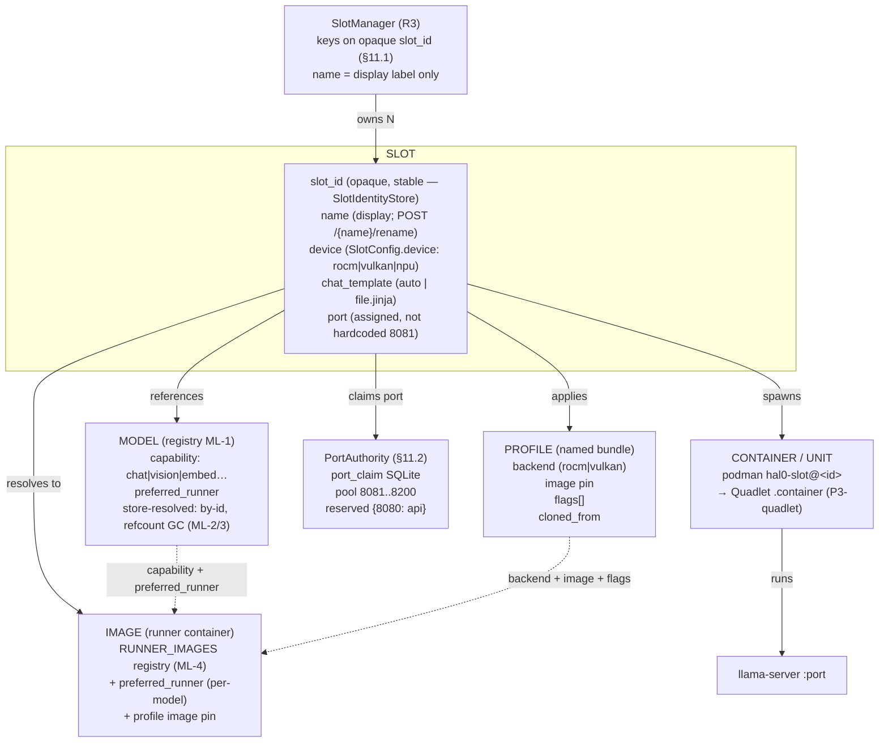
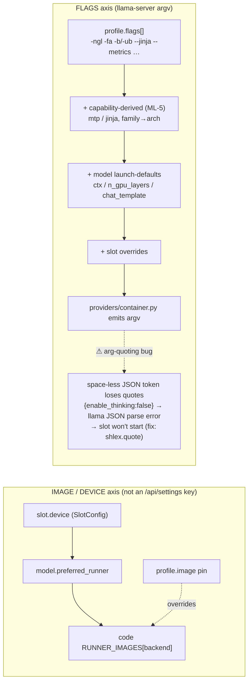
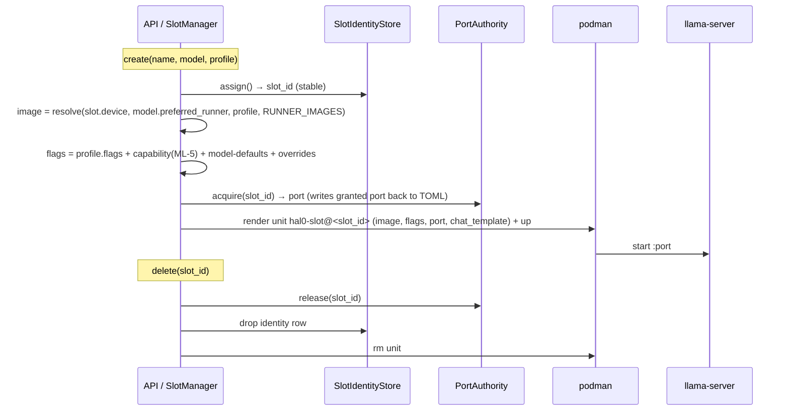

# Slot / Model / Profile / Flags / Image — reworked runtime model (R3)

How a slot resolves and spawns in the post-rework (R3) runtime. Status: increment A landed
(slot-id + PortAuthority live); increment B (internal `dict[int]` re-key + `hal0-slot@<id>` unit
rename), the `container.py` arg-quoting fix, and P3-quadlet are still open — see `REWORK_BOARD.md`.

## Entities & relationships



## Resolution precedence (highest wins)



## Spawn / teardown sequence



## Key invariants (new vs old)
- **Identity = `slot_id`, not `name`.** Rename is cheap, no re-spawn. (Increment A: rename requires the
  slot OFFLINE until increment B re-keys the internal dicts + renames the `hal0-slot@<id>` unit.)
- **Port is authority-allocated** (`PortAuthority`, pool 8081..8200, 8080 reserved for the API) — never
  the old hardcoded `8081` default.
- **One source per axis:** image = `RUNNER_IMAGES` (+ `preferred_runner` + profile pin); ports =
  `PortAuthority`; chat_template = per-slot; flags = profile → capability → model-defaults → slot.
- **No-think caveat:** reasoning models (MiniCPM5 / saber) need `enable_thinking=false` to land the
  answer in `content`; today the only lever is the broken `--chat-template-kwargs` flag. Fix = the
  `container.py` quoting bug OR a `*-nothink.jinja` that defaults it internally. See
  `hal0-105-changes-summary.md`.

## Appendix — ASCII rendering (for plain-text viewers)

```
                          ┌─────────────────────────────────────────────┐
                          │              SlotManager  (R3)               │
                          │  keys everything on opaque slot_id (§11.1)   │
                          │  name = display label only (renamable)       │
                          └───────────────┬─────────────────────────────┘
                                          │ owns N
                                          ▼
   ┌──────────────────────────────────────────────────────────────────────────────┐
   │  SLOT                                                                          │
   │  ─ slot_id  (opaque, stable; SlotIdentityStore)   ← identity, never the name  │
   │  ─ name     (display label; POST /{name}/rename)                              │
   │  ─ device   (SlotConfig.device: rocm|vulkan|npu…) ← per-slot override         │
   │  ─ chat_template (auto | file.jinja)                                          │
   │  ─ port     (assigned, NOT hardcoded 8081)                                    │
   └───┬───────────────┬──────────────────┬───────────────┬─────────────────┬──────┘
       │ references     │ applies          │ resolves-to    │ claims          │ spawns
       ▼                ▼                  ▼                ▼                 ▼
  ┌─────────┐    ┌────────────┐     ┌────────────┐   ┌──────────────┐  ┌──────────────────┐
  │ MODEL   │    │ PROFILE    │     │ IMAGE      │   │ PortAuthority│  │ CONTAINER / UNIT │
  │(registry│    │(named      │     │(runner     │   │  (§11.2)     │  │ podman           │
  │ ML-1)   │    │ bundle)    │     │ container) │   │ port_claim   │  │ hal0-slot@<id>   │
  └────┬────┘    └─────┬──────┘     └─────┬──────┘   │ SQLite       │  │ → Quadlet        │
       │               │                  │          │ pool         │  │  .container      │
       │               │                  │          │ 8081..8200   │  │  (P3-quadlet)    │
       │               │                  │          │ reserved     │  └────────┬─────────┘
       │               │                  │          │ {8080:api}   │           │ runs
       │               │                  │          └──────────────┘           ▼
       │               │                  │                              ┌───────────────┐
       │               │                  │                              │ llama-server  │
       │               │                  │                              │  :port        │
       │               │                  │                              └───────────────┘
       ▼               ▼                  ▼
  capability      backend (rocm/       RUNNER_IMAGES registry (ML-4)
  (chat/vision/   vulkan) + image     + preferred_runner (per-model)
   embed…)         pin + FLAGS[]      + profile image pin
  preferred_       + cloned_from
   runner
  store-resolved
  (by-id, refcnt
   GC, ML-2/3)
```

### IMAGE / DEVICE axis (highest wins)
```
slot.device (SlotConfig)  →  model.preferred_runner  →  code RUNNER_IMAGES[backend]
profile.image pin overrides the runner-registry image when set
```
This axis is NOT an `/api/settings` key (BackendGpuPage finding) — it is per-slot → per-model → code.

### FLAGS axis (llama-server argv, highest wins)
```
profile.flags[]  (base bundle: -ngl, -fa, -b/-ub, --jinja, --metrics …)
  + capability-derived flags (ML-5: mtp / jinja from model capability, family→arch)
  + model launch-defaults (ctx / n_gpu_layers / chat_template → Model-Defaults page)
  + slot-level overrides
  → assembled command → providers/container.py emits argv
      ⚠ arg-quoting bug: a space-less JSON token loses its double-quotes
        (`{enable_thinking:false}`) → llama-server JSON parse error → slot won't
        start.  Fix: shlex.quote the value.  Workaround: chat_template: auto.
```

### Spawn / teardown (text)
```
create(name, model, profile)
  → slot_id = SlotIdentityStore.assign()          (stable id)
  → image   = resolve(slot.device, model.preferred_runner, profile, RUNNER_IMAGES)
  → flags   = profile.flags + capability(ML-5) + model-defaults + overrides
  → port    = PortAuthority.acquire(slot_id)       (writes granted port back to TOML)
  → unit    = render(hal0-slot@<slot_id>, image, flags, port, chat_template)
  → podman up → llama-server :port
delete(slot_id) → PortAuthority.release + drop identity row + rm unit
```
